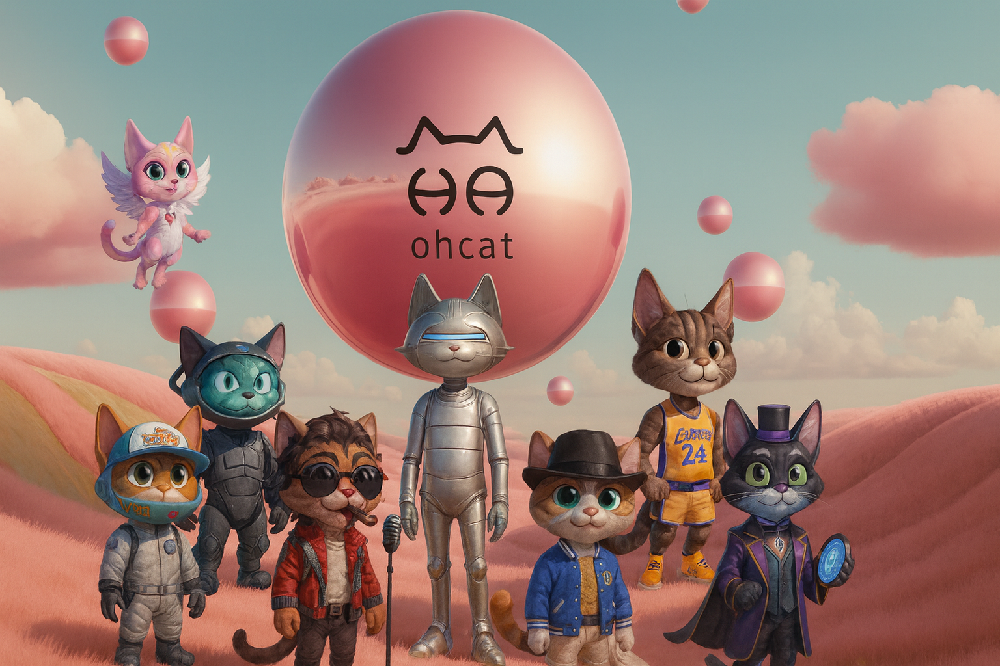
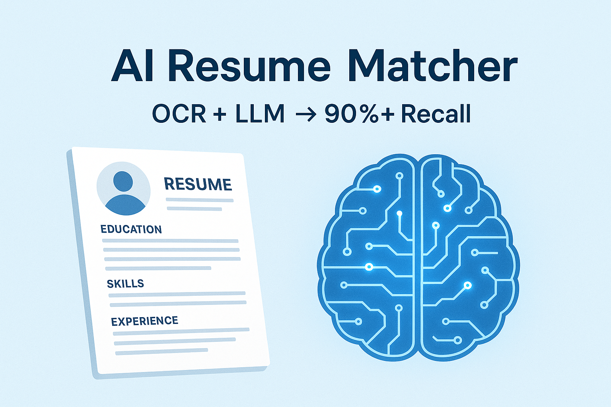
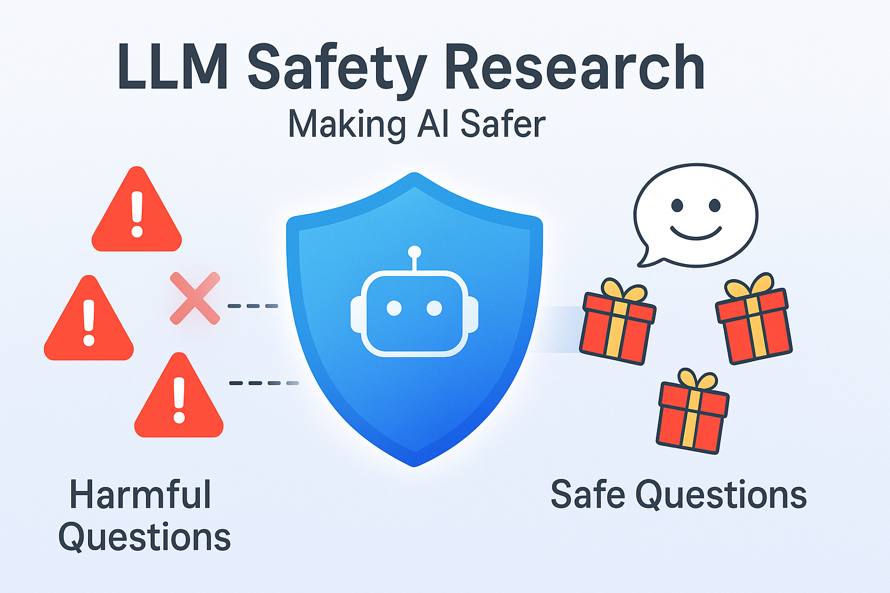
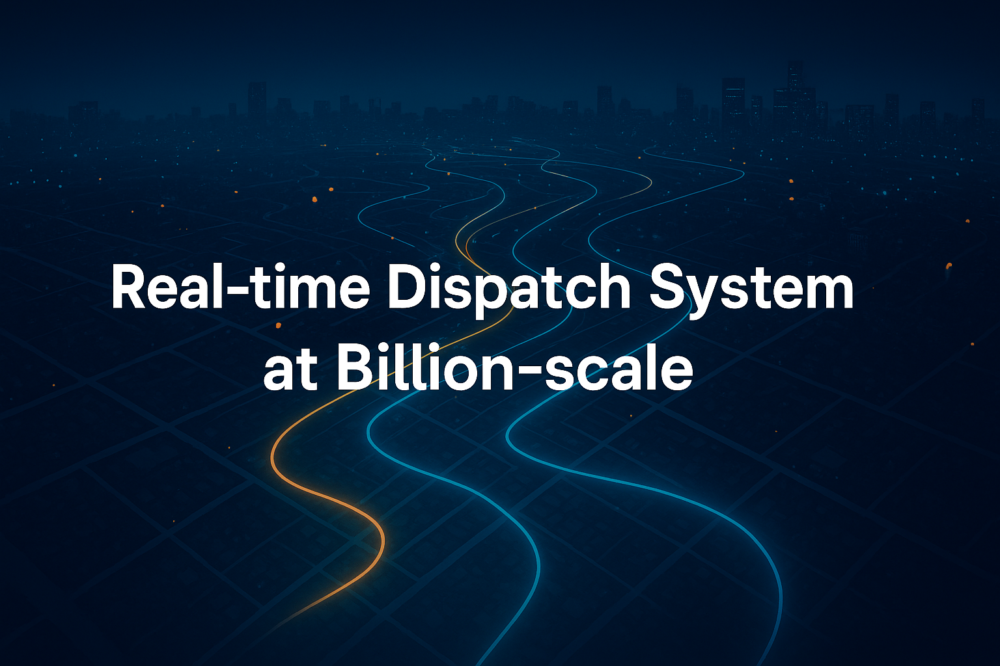

# Hi there 👋 I'm Antony Zhao  

 

🎓 MEng in Electrical & Computer Engineering @ Duke (GPA: 4.0/4.0)  
💻 Full-stack & AI Systems Engineer | Ex-SDE @ Meituan  
🚀 Goal: build AI products that deliver clear user impact  

## Skills

**Languages & Frameworks**  
 

 
 
 
 
  

**AI / ML**  
 
 

**Infrastructure & Tools**  
 
 
 
 
 
 
  
 <!-- 
## 🌟 Featured Projects

<table>
  <!-- Talking Character App -->
  <tr>
    <td width="260" align="center">
      <a href="https://github.com/Antony957/ohcat"><strong>Talking Character App</strong></a> 
      
    </td>
    <td>
      <ul>
        <li><strong>Overview</strong>: LLM-powered virtual character application enabling real-time voice conversations with <strong>customizable styles</strong> and <strong>animations</strong>.</li>
        <li><strong>Tech Stack</strong>: <strong>React / Next.js</strong>, <strong>Flask</strong>, <strong>PyTorch</strong>, LoRA fine-tuning, <strong>WebSocket real-time communication</strong>, animation rendering.</li>
        <li><strong>Impact</strong>: Delivered a <strong>full-stack voice chat platform</strong> with efficient <strong>hot-reload LoRA integration</strong>; collaborated with product and animation teams to create <strong>seamless, immersive user experiences</strong>.</li>
      </ul>
    </td>
  </tr>

  <!-- AI Resume Matcher -->
  <tr>
    <td width="260" align="center">
      <a href="https://github.com/Antony957/ai_resume_matcher"><strong>AI Resume Matcher</strong></a> 
      
    </td>
    <td>
      <ul>
        <li><strong>Overview</strong>: AI-driven recruitment assistant that parses <strong>unstructured resumes</strong> into <strong>structured candidate profiles</strong> and matches them with job descriptions.</li>
        <li><strong>Tech Stack</strong>: <strong>OCR + LLM pipeline</strong>, semantic embedding search, <strong>vector retrieval</strong>, Flask backend.</li>
        <li><strong>Impact</strong>: Achieved <strong>90%+ recall</strong> in information extraction; reduced manual resume screening workload by <strong>~80%</strong> for the client.</li>
      </ul>
    </td>
  </tr>

  <!-- Research in LLM Safety -->
  <tr>
    <td width="260" align="center">
      <a href="https://github.com/Antony957/llm_safety"><strong>Research in LLM Safety</strong></a> 
      
    </td>
    <td>
      <ul>
        <li><strong>Overview</strong>: Research project focusing on enhancing <strong>robustness</strong> of large language models against <strong>jailbreak</strong> and adversarial attacks.</li>
        <li><strong>Tech Stack</strong>: Security control mechanisms for multiple LLMs (e.g., <strong>Vicuna</strong>), evaluation against baselines, adversarial testing.</li>
        <li><strong>Impact</strong>: Improved robustness against jailbreak attacks by <strong>~60%</strong>; published <strong>2 first-author papers</strong> in peer-reviewed venues.</li>
      </ul>
    </td>
  </tr>

  <!-- Work Experience at Meituan -->
  <tr>
    <td width="260" align="center">
      <a href="https://github.com/Antony957/meituan_dispatch"><strong>Work Experience at Meituan</strong></a> 
      
    </td>
    <td>
      <ul>
        <li><strong>Overview</strong>: Large-scale <strong>mobility dispatching</strong> and <strong>visualization systems</strong>, including simulation, playback, and data pipelines.</li>
        <li><strong>Tech Stack</strong>: <strong>Flink</strong>, <strong>HBase/Hive</strong>, <strong>Kafka</strong>, <strong>Spring Boot</strong>, A/B testing frameworks, front-end visualization.</li>
        <li><strong>Impact</strong>:
          <ul>
            <li>Designed and delivered a <strong>playback system</strong> for <strong>billions of mobility data points</strong>, reducing <strong>~5,000 hours</strong> of manual work annually.</li>
            <li>Built a <strong>dispatch model simulation platform</strong> to efficiently evaluate <strong>100+ strategies</strong>.</li>
            <li>Implemented a <strong>high-throughput data pipeline</strong> (<strong>10M+ logs/day</strong>), accelerating model tuning cycles by <strong>16%</strong> and improving ROI by <strong>25%</strong>.</li>
          </ul>
        </li>
      </ul>
    </td>
  </tr>
</table>
-->
